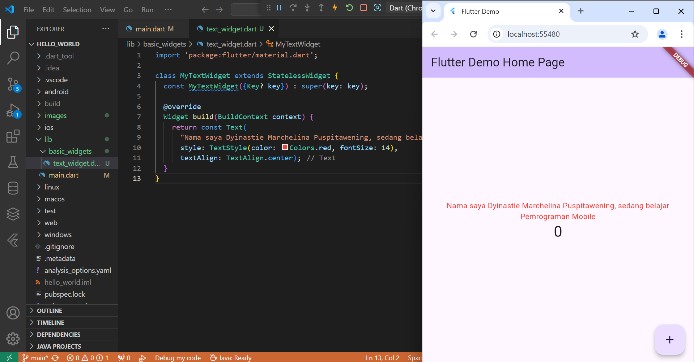
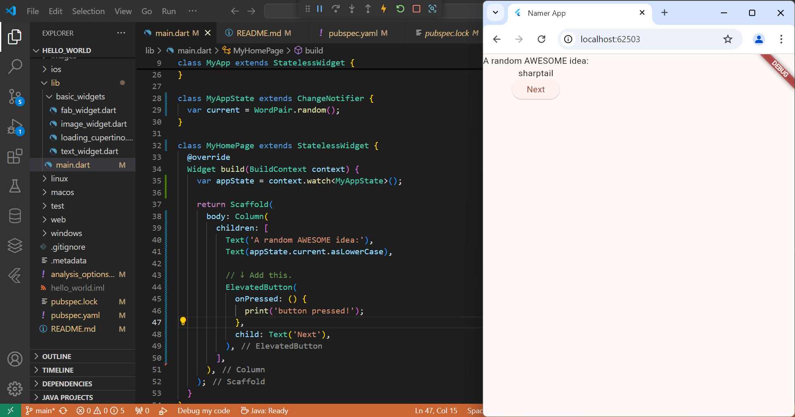

# hello_world

A new Flutter project.

---
> Nama  : Dyinastie Marchelina Puspitawening

> NIM   : 2241720166

> Kelas : TI-3D (08)
---

## Laporan Jobsheet 5

### Praktikum 1

Membuat Project Flutter Baru

### Praktikum 2

Menghubungkan Perangkat Android atau Emulator dengan USB Debug di ponsel

### Praktikum 3

Menghubungkan dengan GitHub

Menjalankan Projek hello_world

Membuat laporan

### Praktikum 4

#### Langkah 1 : Text Widget

#### Langkah 2 : Image Widget

### Praktikum 5

#### Langkah 1: Cupertino Button dan Loading Bar

#### Langkah 2: Floating Action Button (FAB)

#### Langkah 3: Scaffold Widget

#### Langkah 4: Dialog Widget

#### Langkah 5: Input dan Selection Widget

#### Langkah 6: Date and Time Pickers

### Tugas : Codelabs

#### Menambahkan tombol

#### Memperindah tampilan aplikasi

#### Menambahkan fungsi

#### Menambahkan kolom samping navigasi 

#### Menambahkan halaman baru

